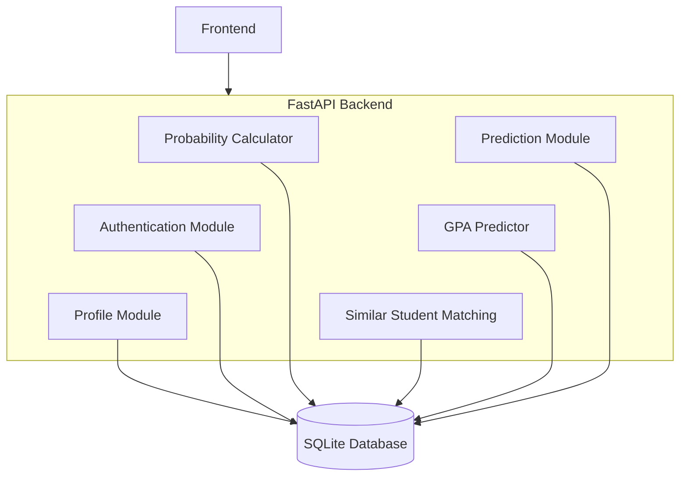
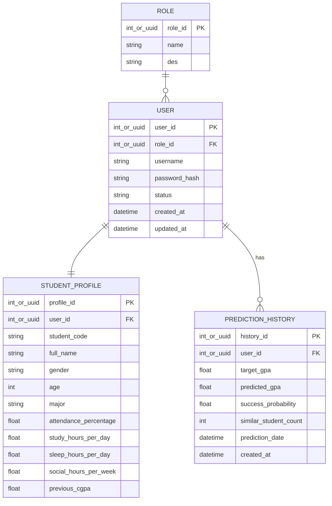

## TÀI LIỆU ĐẶC TẢ YÊU CẦU DỰ ÁN (SPECIFICATIONS)

**Tên module**:
CÔNG CỤ DỰ ĐOÁN KHẢ NĂNG ĐẠT MỤC TIÊU HỌC TẬP

Version: 1.3.2

# 1. TỔNG QUAN & MỤC TIÊU

## 1.1. Tổng quan

Hệ thống được xây dựng nhằm hỗ trợ sinh viên đánh giá khả năng đạt được mục tiêu học tập mong muốn dựa trên dữ liệu học tập và thói quen sinh hoạt hiện tại.

Khác với các hệ thống chỉ dự đoán điểm số cuối cùng, hệ thống này tập trung vào việc ước lượng xác suất đạt được một mức GPA mục tiêu do người dùng lựa chọn.

Để thực hiện điều này, hệ thống sử dụng hai lớp xử lý:

- Dự đoán GPA dự kiến của sinh viên bằng Machine Learning.
- So khớp sinh viên hiện tại với các mẫu dữ liệu lịch sử để tính toán tỷ lệ thành công đối với GPA mục tiêu.

Kết quả cuối cùng được cung cấp dưới dạng:

- GPA dự đoán.
- Tỷ lệ đạt được GPA mục tiêu.
- Dữ liệu hỗ trợ trực quan hóa kết quả.

Hệ thống được xây dựng dưới dạng dịch vụ API độc lập và website tương tác nhằm phục vụ mục đích nghiên cứu, học tập và trình diễn.

## 1.2. Mục tiêu

Mục tiêu của hệ thống:

- Dự đoán GPA dự kiến của sinh viên dựa trên dữ liệu hiện tại.
- Ước lượng khả năng đạt được GPA mục tiêu do người dùng lựa chọn.
- Hỗ trợ sinh viên đánh giá và điều chỉnh kế hoạch học tập.
- Cung cấp kết quả thông qua giao diện web trực quan.
- Xây dựng nền tảng có khả năng mở rộng và thay thế mô hình Machine Learning trong tương lai.

# 2. YÊU CẦU DỮ LIỆU & GIAO TIẾP (I/O CONSTRAINTS)

## 2.1. Dữ liệu huấn luyện

Phiên bản hiện tại sử dụng bộ dữ liệu:

**University Student Performance & Habits Dataset**

| Thông tin | Mô tả |
| --- | --- |
| Số lượng bản ghi | Khoảng 5.000 bản ghi |
| Trạng thái dữ liệu | Dữ liệu đã được ẩn danh |
| Dữ liệu nhận dạng cá nhân | Không chứa dữ liệu nhận dạng cá nhân |
| Dữ liệu thiếu | Không chứa dữ liệu thiếu đáng kể |
| Phạm vi giá trị GPA | Từ 0.0 đến 4.0 |

### Các thuộc tính đầu vào và biến mục tiêu

| Loại | Thuộc tính |
| --- | --- |
| Đầu vào | Gender |
| Đầu vào | Age |
| Đầu vào | Major |
| Đầu vào | Attendance_Pct |
| Đầu vào | Study_Hours_Per_Day |
| Đầu vào | Previous_CGPA |
| Đầu vào | Sleep_Hours |
| Đầu vào | Social_Hours_Week |
| Biến mục tiêu | Final_CGPA |

## 2.2. Đầu vào API

Prediction API chỉ nhận GPA mục tiêu.

Các thuộc tính học tập và sinh hoạt được lấy từ hồ sơ sinh viên (Student Profile) đã lưu trong cơ sở dữ liệu.

Ví dụ:

```JSON
{
  "target_gpa": 3.5
}
```

## 2.3. Đầu ra API

API trả về:

- GPA dự đoán.
- GPA mục tiêu.
- Tỷ lệ đạt được GPA mục tiêu.

Ví dụ:

```JSON
{
  "predicted_gpa": 3.28,
  "target_gpa": 3.50,
  "success_probability": 74.0
}
```

Hệ thống có thể mở rộng để trả về dữ liệu phục vụ biểu đồ trong các phiên bản tiếp theo.

# 3. YÊU CẦU CHỨC NĂNG (FUNCTIONAL REQUIREMENTS)

| Mã | Yêu cầu chức năng |
| --- | --- |
| <span style="white-space: nowrap;">FR-01</span> | Hệ thống phải cho phép sinh viên đăng nhập bằng tài khoản được cấp bởi quản trị viên. |
| FR-02 | Hệ thống phải cho phép sinh viên xem hồ sơ học tập và thông tin cá nhân của mình. |
| FR-03 | Hệ thống phải cho phép sinh viên nhập GPA mục tiêu. |
| FR-04 | Hệ thống phải xử lý yêu cầu dự đoán dựa trên hồ sơ sinh viên hiện có và GPA mục tiêu được nhập. |
| FR-05 | Hệ thống phải thực hiện so khớp với dữ liệu lịch sử nhằm tính toán tỷ lệ thành công. |
| FR-06 | Hệ thống phải hiển thị GPA dự đoán. |
| FR-07 | Hệ thống phải hiển thị GPA mục tiêu. |
| FR-08 | Hệ thống phải hiển thị tỷ lệ đạt được GPA mục tiêu. |
| FR-09 | Hệ thống phải lưu lịch sử dự đoán của sinh viên. |
| FR-10 | Hệ thống phải cho phép sinh viên xem lịch sử dự đoán trong ngày. |
| FR-11 | Hệ thống phải cung cấp giao diện quản trị. |
| FR-12 | Quản trị viên phải có khả năng: Tạo tài khoản sinh viên; Khóa tài khoản; Mở khóa tài khoản; Xem hồ sơ sinh viên; Tạo hồ sơ sinh viên; Cập nhật hồ sơ sinh viên; Quản lý danh sách người dùng. |
| FR-13 | Hệ thống phải ghi nhận thời gian thực hiện dự đoán. |

# 4. QUY TẮC NGHIỆP VỤ (BUSINESS RULES)

| Mã | Quy tắc nghiệp vụ |
| --- | --- |
| <span style="white-space: nowrap;">BR-01</span> | Mỗi sinh viên chỉ được phép thực hiện tối đa một lần dự đoán trong một ngày. |
| BR-02 | Nếu sinh viên đã thực hiện dự đoán trong ngày hiện tại, hệ thống phải từ chối yêu cầu dự đoán mới. |
| BR-03 | Kết quả dự đoán được lưu đến hết ngày hiện tại. |
| BR-04 | Sau thời điểm chuyển sang ngày mới (00:00), sinh viên được phép thực hiện dự đoán mới. |
| BR-05 | Sinh viên không được phép tự đăng ký tài khoản. |
| BR-06 | Mọi tài khoản sinh viên phải được tạo bởi quản trị viên hệ thống. |

# 5. YÊU CẦU KIẾN TRÚC & THUẬT TOÁN

## 5.1. Kiến trúc tổng thể

Hệ thống được xây dựng theo mô hình:



## 5.2. GPA Predictor

Phiên bản đầu tiên sử dụng: **LightGBM** Regressor

Mục tiêu: Dự đoán GPA dự kiến của sinh viên.

Kết quả này được sử dụng làm đầu vào cho các bước xử lý tiếp theo.

## 5.3. Similar Student Matching Engine

Hệ thống phải hỗ trợ tìm kiếm các sinh viên lịch sử có đặc điểm tương đồng với sinh viên hiện tại.

Dữ liệu được sử dụng từ tập Historical Dataset.

Mục tiêu:

- Tìm nhóm sinh viên tương đồng.
- Phân tích kết quả học tập thực tế của nhóm này.
- Hỗ trợ tính toán xác suất đạt GPA mục tiêu.

## 5.4. Probability Calculator

Hệ thống phải tính toán tỷ lệ đạt GPA mục tiêu dựa trên:

- GPA dự đoán.
- GPA mục tiêu.
- Kết quả từ Similar Student Matching Engine.

Nguyên tắc tính toán cơ bản:

$$
\text{Success Probability}
  = \frac{\text{Số sinh viên tương đồng đạt GPA mục tiêu}}
    {\text{Tổng số sinh viên tương đồng}}
$$

Trong đó:

- **Success Probability**: Xác suất sinh viên đạt GPA mục tiêu.
- **Số sinh viên tương đồng đạt GPA mục tiêu**: Số sinh viên trong nhóm tương đồng có GPA đạt hoặc vượt GPA mục tiêu.
- **Tổng số sinh viên tương đồng**: Tổng số sinh viên được lựa chọn bởi Similar Student Matching Engine.

Similar Student Matching sử dụng thuật toán K-Nearest Neighbors (KNN) trên dữ liệu đã được chuẩn hóa.

Giá trị K sẽ được xác định trong giai đoạn triển khai và đánh giá mô hình.

Kết quả trả về dưới dạng phần trăm (%).

Ví dụ: `74.0` nghĩa là 74%.

## 5.5. Data Pipeline

| Thành phần | Mô tả |
| --- | --- |
| Data Validation | Kiểm tra tính hợp lệ của dữ liệu đầu vào |
| Feature Encoding | Mã hóa các thuộc tính đầu vào |
| Feature Transformation | Chuyển đổi dữ liệu theo yêu cầu của mô hình |
| Model Inference | Thực hiện suy luận bằng mô hình |
| Similarity Processing | Xử lý mức độ tương đồng |
| Probability Calculation | Tính toán xác suất |

Pipeline phải được lưu trữ thống nhất.

Định dạng đề xuất: `.pkl`, `.onnx`

# 6. YÊU CẦU PHI CHỨC NĂNG (NON-FUNCTIONAL REQUIREMENTS)

| Mã | Yêu cầu phi chức năng |
| --- | --- |
| <span style="white-space: nowrap;">NFR-01</span> | Toàn bộ quá trình suy diễn phải hoạt động trên CPU. |
| NFR-02 | Thời gian phản hồi trung bình cho một yêu cầu dự đoán không vượt quá 100ms trong điều kiện dữ liệu hợp lệ. |
| NFR-03 | Dung lượng RAM sử dụng của hệ thống không vượt quá 500MB. |
| NFR-04 | Thời gian khởi động dịch vụ không vượt quá 3 giây. |
| NFR-05 | API phải tuân thủ chuẩn RESTful. |
| NFR-06 | Dữ liệu trao đổi phải sử dụng JSON. |
| NFR-07 | Hệ thống phải hỗ trợ triển khai độc lập bằng Docker. |

# 7. YÊU CẦU CƠ SỞ DỮ LIỆU

Cơ sở dữ liệu tối thiểu gồm 4 nhóm thực thể chính: `User`, `StudentProfile`, `PredictionHistory` và `Role`.

## 7.1. Sơ đồ quan hệ dữ liệu



Trong đó:

- **User** lưu thông tin tài khoản, xác thực, phân quyền và trạng thái người dùng.
- **StudentProfile** lưu thông tin cá nhân và các đặc trưng học tập của sinh viên.
- **PredictionHistory** lưu lịch sử các lần dự đoán GPA.
- **StudentProfile.`user_id`** tham chiếu đến **User.`user_id`**.
- **PredictionHistory.`user_id`** tham chiếu đến **User.`user_id`**.
- **User.`role_id`** tham chiếu **Role.`role_id`**

## 7.2. User

| Trường | Kiểu dữ liệu đề xuất | Ràng buộc | Mô tả |
| --- | --- | --- | --- |
| `user_id` | BIGINT / UUID | PK | Định danh duy nhất của người dùng |
| `role_id` | BIGINT / UUID | FK | Vai trò của người dùng, ví dụ `"STUDENT"` hoặc `"ADMIN"` |
| `username` | VARCHAR | UNIQUE, NOT NULL | Tên đăng nhập |
| `password_hash` | VARCHAR | NOT NULL | Mật khẩu đã được băm |
| `status` | VARCHAR / ENUM | NOT NULL | Trạng thái tài khoản |
| `created_at` | TIMESTAMP | NOT NULL | Thời điểm tạo tài khoản |
| `updated_at` | TIMESTAMP | NOT NULL | Thời điểm cập nhật tài khoản |

## 7.3. StudentProfile

| Trường | Kiểu dữ liệu đề xuất | Ràng buộc | Mô tả |
| --- | --- | --- | --- |
| `profile_id` | BIGINT / UUID | PK | Định danh hồ sơ |
| `user_id` | BIGINT / UUID | FK, UNIQUE, NOT NULL | Tham chiếu đến **User**.`user_id` |
| `student_code` | VARCHAR | UNIQUE, NOT NULL | Mã số sinh viên |
| `full_name` | VARCHAR | NOT NULL | Họ và tên sinh viên |
| `gender` | VARCHAR / ENUM | - | Giới tính |
| `age` | INT | - | Tuổi |
| `major` | VARCHAR | - | Ngành học |
| `attendance_percentage` | DECIMAL | - | Tỷ lệ chuyên cần |
| `study_hours_per_day` | DECIMAL | - | Số giờ học trung bình mỗi ngày |
| `sleep_hours_per_day` | DECIMAL | - | Số giờ ngủ trung bình mỗi ngày |
| `social_hours_per_week` | DECIMAL | - | Số giờ hoạt động xã hội trung bình mỗi tuần |
| `previous_cgpa` | DECIMAL | - | CGPA trước đó |

## 7.4. PredictionHistory

| Trường | Kiểu dữ liệu đề xuất | Ràng buộc | Mô tả |
| --- | --- | --- | --- |
| `history_id` | BIGINT / UUID | PK | Định danh bản ghi dự đoán |
| `user_id` | BIGINT / UUID | FK, NOT NULL | Tham chiếu đến **User.`user_id`** |
| `target_gpa` | DECIMAL | NOT NULL | GPA mục tiêu |
| `predicted_gpa` | DECIMAL | NOT NULL | GPA dự đoán |
| `success_probability` | DECIMAL / FLOAT | NOT NULL | Xác suất đạt GPA mục tiêu |
| `similar_student_count` | INT | NOT NULL | Số lượng sinh viên tương đồng được sử dụng |
| `prediction_date` | DATE | NOT NULL | Ngày thực hiện dự đoán |
| `created_at` | TIMESTAMP | NOT NULL | Thời điểm tạo bản ghi |

## 7.5. Role

| Trường | Kiểu dữ liệu đề xuất | Ràng buộc | Mô tả |
| --- | --- | --- | --- |
| `role_id` | BIGINT / UUID | PK | Định danh bảng Role |
| `name` | VARCHAR | UNIQUE | Tên của Role |
| `desc` | VARCHAR | - | Mô tả của Role |

## 7.6. Tóm tắt

| Thực thể | Mục đích | Quan hệ |
| --- | --- | --- |
| User | Quản lý tài khoản, xác thực và phân quyền | 1:1 với StudentProfile; 1:N với PredictionHistory |
| StudentProfile | Lưu thông tin cá nhân và đặc trưng học tập | N:1 với User |
| PredictionHistory | Lưu kết quả và lịch sử dự đoán | N:1 với User |
| Role | Lưu thông tin về Role | N:1 với User |

# 8. TIÊU CHUẨN ĐÁNH GIÁ MÔ HÌNH

Do hệ thống gồm nhiều lớp xử lý, việc đánh giá được chia thành hai phần.

## 8.1. GPA Prediction Layer

| Chỉ số đánh giá | Mục đích |
| --- | --- |
| MAE | Đánh giá sai số tuyệt đối trung bình |
| RMSE | Đánh giá mức độ sai lệch của dự đoán |
| R² Score | Đánh giá mức độ phù hợp của mô hình |

## 8.2. Probability Layer

| Tiêu chí đánh giá | Mục đích |
| --- | --- |
| Success Probability Validation | Đánh giá khả năng phản ánh kết quả lịch sử |
| Historical Matching Consistency | Đánh giá tính nhất quán khi đối chiếu với dữ liệu lịch sử |

_Note_: Chi tiết phương pháp đánh giá sẽ được xác định trong giai đoạn thiết kế và thực nghiệm.

# 9. TIÊU CHUẨN BÀN GIAO

| Hạng mục | Thành phần bàn giao |
| --- | --- |
| Source Code | Frontend Source Code<br>Backend Source Code<br>Machine Learning Source Code |
| Model Artifact | Trained Model<br>Pipeline Artifact |
| Deployment | Dockerfile<br>docker-compose.yml |
| Documentation | Project Proposal<br>Software Requirements Specification (SRS)<br>Software Design Document (SDD)<br>Test Plan & Test Cases<br>Deployment Guide<br>Final Report |

# 10. HƯỚNG MỞ RỘNG TƯƠNG LAI

Các nội dung không thuộc phạm vi Version 1:

- Sử dụng dữ liệu thực tế của nhà trường.
- So sánh nhiều thuật toán Machine Learning.
- Bổ sung Probability Curve Visualization.
- Explainable AI.
- Chuyển sang PostgreSQL hoặc MongoDB.
- JWT và RBAC hoàn chỉnh.
- Triển khai Cloud.
- Batch Prediction cho nhiều sinh viên cùng lúc.

END OF SPECIFICATION
