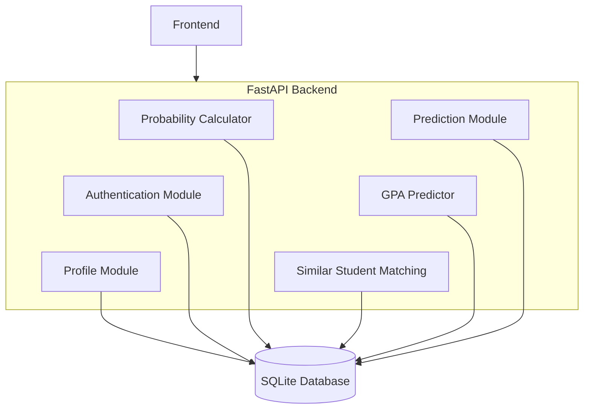
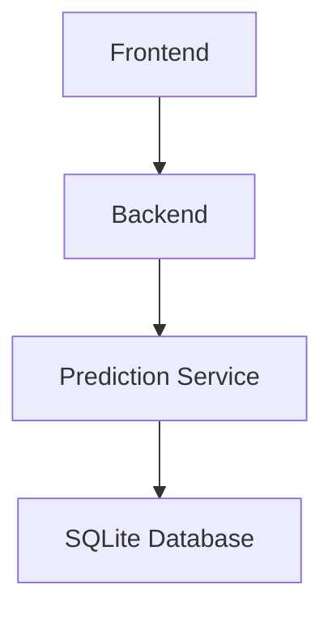

# SOFTWARE REQUIREMENTS SPECIFICATION (SRS)

## Target GPA Achievement Prediction System

## Document Information

| Item | Value |
| --- | --- |
| Project Name | Target GPA Achievement Prediction System |
| Vietnamese Name | Hệ thống dự đoán khả năng đạt GPA mục tiêu |
| Version | 1.1.3 |
| Document Type | Software Requirements Specification |
| Development Team | 2 Members |
| Project Duration | 12 Weeks |
| Status | Draft |

# 1. Introduction

## 1.1 Purpose

Tài liệu này mô tả các yêu cầu chức năng và phi chức năng của hệ thống dự đoán khả năng đạt GPA mục tiêu.

Mục đích của hệ thống là hỗ trợ sinh viên đánh giá khả năng đạt được GPA mong muốn dựa trên hồ sơ học tập hiện tại và dữ liệu lịch sử đã được sử dụng để huấn luyện mô hình Machine Learning.

Tài liệu này là cơ sở cho các hoạt động:

- Thiết kế hệ thống (SDD)
- Phát triển phần mềm
- Kiểm thử
- Triển khai

## 1.2 Scope

Hệ thống cho phép:

- Quản lý tài khoản người dùng.
- Quản lý hồ sơ sinh viên.
- Dự đoán GPA kỳ vọng.
- Ước lượng xác suất đạt GPA mục tiêu.
- Xem kết quả dự đoán.
- Xem lịch sử dự đoán trong ngày.

Phiên bản 1 tập trung vào việc cung cấp chức năng dự đoán cơ bản và quản trị người dùng.

## 1.3 Intended Audience

Tài liệu dành cho:

- Nhóm phát triển.
- Giảng viên hướng dẫn.
- Người kiểm thử.
- Người đánh giá đồ án.

## 1.4 References

- SPEC v1.3.2
- Project Proposal (Short Version)
- Project Proposal (Detailed Version)
- SRS Preparation v1

# 2. Overall Description

## 2.1 Product Perspective

Hệ thống là một ứng dụng web bao gồm:

- Frontend
- Backend API
- Machine Learning Prediction Service
- Database

Mô hình tổng quát:



```text
Student
    │
    ▼
Web Application
    │
    ▼
Prediction Service
    │
    ▼
SQLite Database
```




## 2.2 Product Functions

Các chức năng chính:

### Student

- Đăng nhập.
- Xem hồ sơ cá nhân.
- Thực hiện dự đoán.
- Xem kết quả dự đoán.
- Xem lịch sử dự đoán trong ngày.
- Đăng xuất.

### Admin

- Đăng nhập.
- Tạo tài khoản.
- Quản lý tài khoản.
- Quản lý hồ sơ sinh viên.
- Khóa tài khoản.
- Mở khóa tài khoản.
- Đăng xuất.

## 2.3 User Classes

| Tên | Mô tả | Quyền |
| --- | --- | --- |
| Student | Người sử dụng chính của hệ thống | - View Profile<br>- Predict GPA Achievement<br>- View Prediction History |
| Admin | Người quản trị hệ thống | - User Management<br>- Student Profile Management |

## 2.4 Operating Environment

### Backend

- Python
- FastAPI

### Machine Learning

- LightGBM
- Scikit-Learn

### Database

- SQLite

### Deployment

- Docker
- Docker Compose

### Runtime

- CPU Only

## 2.5 Constraints

- Không sử dụng GPU.
- Chỉ hỗ trợ Web Application.
- Chỉ cho phép một lần dự đoán mỗi ngày.
- Student không được tự đăng ký tài khoản.
- Student không được sửa hồ sơ cá nhân.

## 2.6 Assumptions

- Dataset huấn luyện đã được chuẩn bị trước.
- Model đã được huấn luyện trước khi triển khai.
- Admin chịu trách nhiệm cập nhật dữ liệu hồ sơ sinh viên.

# 3. System Actors

| Actor | Name | Description | Permissions |
| --- | --- | --- | --- |
| A1 | Student | Người sử dụng chức năng dự đoán. | - Login<br>- View Profile<br>- Submit Prediction Request<br>- View Prediction Result<br>- View Prediction History<br>- Logout |
| A2 | Admin | Người quản trị hệ thống. | - Login<br>- Create User<br>- Manage User<br>- Manage Student Profile<br>- Lock User<br>- Unlock User<br>- Logout |

# 4. Functional Requirements

| ID | Functional Requirement | Description | Input | Processing | Operations | Output |
| --- | --- | --- | --- | --- | --- | --- |
| <span style="white-space: nowrap;">FR-01</span> | Login | Hệ thống cho phép người dùng đăng nhập bằng tài khoản được cấp. | - Username<br>- Password | 1. Xác thực thông tin đăng nhập.<br>2. Kiểm tra trạng thái tài khoản. | - | - Đăng nhập thành công.<br>- Hoặc thông báo lỗi. |
| FR-02 | Logout | Hệ thống cho phép người dùng đăng xuất khỏi hệ thống. | - | - | - | - |
| FR-03 | View Profile | Student có thể xem hồ sơ cá nhân.| - | - | - | Hiển thị:<br>- Student Code<br>- Full Name<br>- Gender<br>- Age<br>- Major<br>- Attendance Percentage<br>- Study Hours<br>- Sleep Hours<br>- Social Hours<br>- Previous CGPA |
| FR-04 | Submit Prediction Request | Student gửi yêu cầu dự đoán khả năng đạt GPA mục tiêu. | Target GPA | 1. Kiểm tra điều kiện dự đoán.<br>2. Lấy dữ liệu Student Profile.<br>3. Tính Predicted GPA.<br>4. Tìm nhóm sinh viên tương đồng.<br>5. Tính Success Probability.<br>6. Lưu lịch sử. | - | Prediction Result |
| FR-05 | View Prediction Result | Hiển thị kết quả dự đoán. | - | | - | - Predicted GPA<br>- Target GPA<br>- Success Probability<br>- Number of Similar Students<br><br>Ví dụ:<br>Predicted GPA: 3.28<br>Target GPA: 3.50<br>Success Probability: 74.0%<br>Based on 120 Similar Students |
| FR-06 | View Prediction History | Student có thể xem kết quả dự đoán trong ngày hiện tại. | - | - | - | Prediction Result của ngày hiện tại. |
| FR-07 | Create User | Admin có thể tạo tài khoản mới. | - Username<br>- Password<br>- Role | - | - | User mới được tạo. |
| FR-08 | View User List | Admin có thể xem danh sách người dùng. | - | - | - | User List |
| FR-09 | Lock User | Admin có thể khóa tài khoản người dùng. | - | - | - | - |
| FR-10 | Unlock User | Admin có thể mở khóa tài khoản người dùng. | - | - | - | - |
| FR-11 | Manage Student Profile | Admin có thể quản lý hồ sơ sinh viên. | - | - | - Update Profile<br>- View Profile | - |

# 5. Use Case Specifications

## UC-01 Login

### Actor

Student, Admin

### Pre-condition

Tài khoản tồn tại.

### Main Flow

1. Người dùng nhập Username.
2. Người dùng nhập Password.
3. Hệ thống xác thực.
4. Hệ thống tạo phiên đăng nhập.
5. Chuyển tới màn hình chính.

### Alternative Flow

A1. Sai thông tin đăng nhập.

→ Hiển thị lỗi.

A2. Tài khoản bị khóa.

→ Từ chối đăng nhập.

### Post-condition

Người dùng đăng nhập thành công.

## UC-02 Submit Prediction Request

### Actor

Student

### Pre-condition

- Đã đăng nhập.
- Chưa thực hiện dự đoán trong ngày.

### Main Flow

1. Student mở Prediction Page.
2. Hệ thống tải Student Profile.
3. Student nhập Target GPA.
4. Student nhấn Predict.
5. Hệ thống kiểm tra dữ liệu.
6. Hệ thống thực hiện dự đoán GPA.
7. Hệ thống tìm nhóm sinh viên tương đồng.
8. Hệ thống tính Success Probability.
9. Hệ thống lưu Prediction History.
10. Hệ thống hiển thị kết quả.

### Alternative Flow

A1. Student đã dự đoán trong ngày.

→ Từ chối yêu cầu.

A2. Invalid Target GPA

Điều kiện:

target_gpa <= 0 hoặc target_gpa > 4.0

A3. Student Profile không tồn tại

1. Hệ thống không tìm thấy Student Profile.
2. Hệ thống từ chối yêu cầu dự đoán.
3. Hệ thống hiển thị thông báo: `"Student Profile not found."`

### Post-condition

Prediction History được tạo.

## UC-03 View Prediction Result

### Actor

Student

### Pre-condition

Đã có Prediction Result.

### Main Flow

1. Student thực hiện dự đoán.
2. Hệ thống hiển thị kết quả.

### Post-condition

Không có.

## UC-04 View Prediction History

### Actor

Student

### Main Flow

1. Student mở History Page.
2. Hệ thống lấy lịch sử trong ngày.
3. Hiển thị kết quả.

## UC-05 Manage Student Profile

### Actor

Admin

### Main Flow

1. Admin chọn Student Profile.
2. Admin xem hoặc cập nhật dữ liệu.
3. Hệ thống lưu thay đổi.

### Post-condition

Student Profile được cập nhật.

## UC-06 Create User

### Actor

Admin

### Pre-condition

- Admin đã đăng nhập.

### Main Flow

1. Admin mở chức năng Create User.
2. Admin nhập username, password và role.
3. Hệ thống kiểm tra dữ liệu.
4. Hệ thống tạo User mới.
5. Hệ thống tự động tạo Student Profile rỗng tương ứng.
6. Hệ thống hiển thị thông báo thành công.

### Alternative Flow

A1. Username đã tồn tại

→ từ chối tạo.

### Post-condition

- User được tạo.
- Student Profile rỗng được tạo tương ứng.

## UC-07 View User List

### Actor

Admin

### Main Flow

1. Admin mở danh sách User.
2. Hệ thống hiển thị danh sách User.
3. Admin xem thông tin User.

## UC-08 Lock User

### Actor

Admin

### Main Flow

1. Admin chọn User.
2. Admin chọn Lock Account.
3. Hệ thống cập nhật trạng thái LOCKED.
4. Hệ thống hiển thị thông báo thành công.

### Post-condition

User được lên lịch chuyển sang trạng thái LOCKED từ ngày tiếp theo.

## UC-09 Unlock User

### Actor

Admin

### Main Flow

1. Admin chọn User.
2. Admin chọn Unlock Account.
3. Hệ thống cập nhật trạng thái ACTIVE.
4. Hệ thống hiển thị thông báo thành công.

### Post-condition

User ở trạng thái ACTIVE.

# 6. Business Rules

## BR-01

Mỗi Student chỉ được phép thực hiện một lần dự đoán trong một ngày.

## BR-02

Nếu Student đã dự đoán trong ngày hiện tại thì hệ thống phải từ chối yêu cầu mới.

## BR-03

Chức năng View Prediction History chỉ hiển thị kết quả dự đoán của ngày hiện tại.

## BR-04

Student không được tự đăng ký tài khoản.

## BR-05

User có hai trạng thái:

- ACTIVE
- LOCKED

## BR-06

Khi tài khoản bị chuyển sang trạng thái LOCKED, thay đổi sẽ có hiệu lực từ ngày tiếp theo.

Các phiên đăng nhập hiện tại vẫn được phép sử dụng đến hết ngày hiện tại.

## BR-07

Mọi tài khoản Student phải được tạo bởi Admin.

## BR-08

Student không được chỉnh sửa Student Profile.

## BR-09

Admin là đối tượng duy nhất được phép chỉnh sửa Student Profile.

# 7. Data Requirements

## 7.1 Role

| Field | Description |
| --- | --- |
| role_id | Định danh vai trò |
| role_name | Tên vai trò |

Ví dụ:

- ADMIN
- STUDENT

## 7.2 User

| Field | Description |
| --- | --- |
| user_id | Định danh người dùng |
| username | Tên đăng nhập |
| password_hash | Mật khẩu mã hóa |
| role_id | Vai trò |
| status | Trạng thái |
| created_at | Ngày tạo |
| updated_at | Ngày cập nhật |

## 7.3 StudentProfile

| Field | Description |
| --- | --- |
| profile_id | Định danh hồ sơ |
| user_id | Chủ sở hữu |
| student_code | Mã sinh viên |
| full_name | Họ tên |
| gender | Giới tính |
| age | Tuổi |
| major | Chuyên ngành |
| attendance_percentage | Tỷ lệ chuyên cần |
| study_hours_per_day | Số giờ học mỗi ngày |
| sleep_hours_per_day | Số giờ ngủ mỗi ngày |
| social_hours_per_week | Số giờ hoạt động xã hội |
| previous_cgpa | GPA hiện tại |

## 7.4 PredictionHistory

| Field | Description |
| --- | --- |
| history_id | Định danh |
| user_id | Người thực hiện |
| target_gpa | GPA mục tiêu |
| predicted_gpa | GPA dự đoán |
| success_probability | Xác suất thành công |
| similar_student_count | Số sinh viên tương đồng |
| prediction_date | Ngày dự đoán |
| created_at | Thời gian tạo |

## 7.5 Validation Rules

| Field | Rule |
| --- | --- |
| target_gpa | 0 < GPA ≤ 4.0 |
| attendance_percentage | 0 ≤ value ≤ 100 |
| previous_cgpa | 0 ≤ GPA ≤ 4.0 |
| age | > 0 |
| study_hours_per_day | ≥ 0 |
| sleep_hours_per_day | ≥ 0 |
| social_hours_per_week | ≥ 0 |

# 8. Non-Functional Requirements

## NFR-01 Performance

Response Time:

```text
< 100 ms
```

cho một yêu cầu dự đoán trong điều kiện bình thường.

## NFR-02 Resource Usage

Memory Usage:

```text
< 500 MB
```

## NFR-03 Startup Time

Cold Start:

```text
< 3 seconds
```

## NFR-04 Security

- Password phải được mã hóa.
- Chỉ người dùng hợp lệ mới được truy cập hệ thống.
- Student không được truy cập chức năng Admin.

## NFR-05 Maintainability

Hệ thống phải được thiết kế theo kiến trúc module hóa.

## NFR-06 Portability

Hệ thống phải triển khai được bằng Docker.

# 9. Future Enhancements (Out of Scope)

Các chức năng sau không thuộc Version 1:

- Explainable AI
- Multi-model Comparison
- Real-time Retraining
- Cloud Deployment
- Mobile Application
- Student Self Registration
- Historical Analytics Dashboard
- Profile Completeness Validation
- Pending Account Status

# 10. Appendix

## System Context

```text
Student
    │
    ▼
Web Application
    │
    ▼
Prediction Service
    │
    ▼
SQLite Database

Admin
    │
    ▼
Web Application
```

END OF DOCUMENT
